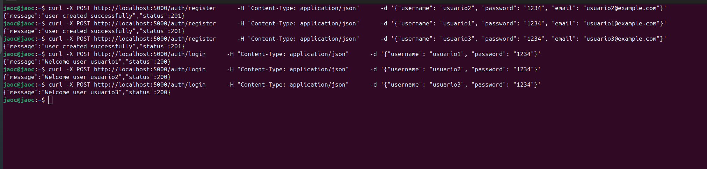

# Register/Login Service with Bcrypt

This guide demonstrates how to set up and use a **register/login service** with Bcrypt for secure password hashing. It includes initializing migrations with Alembic, verifying the database setup, and testing the register and login functionality.

---

## **Start Migration with Alembic**

Once the containers are running, you need to set up your database schema using Alembic.

### **Steps:**

1. **Enter the app container's CLI**:
   ```bash
   docker exec -it <repo_name>-app-1 sh
   ```

2. **Create a migration**:
   ```bash
   alembic revision --autogenerate -m "first commit"
   ```

3. **Apply the migration**:
   ```bash
   alembic upgrade head
   ```

---

## **Verify Database Setup**

To ensure that the database schema has been applied successfully, check the database:

1. **Access the PostgreSQL container**:
   ```bash
   docker exec -it <repo_name>-db-1 psql -U admin -d app_db
   ```

2. **List all tables**:
   ```sql
   \dt
   ```

If successful, you should see the `users` table along with other tables (e.g., `alembic_version`).

---

## **Register a New User**

To register a new user in the system, use the following `curl` command:

```bash
curl -X POST http://localhost:5000/auth/register \
     -H "Content-Type: application/json" \
     -d '{"username": "usuario1", "password": "1234", "email": "usuario1@example.com"}'
```

- **Response**:
  ```json
  {
      "message": "user created successfully",
      "status": 201
  }
  ```

---

## **Login with a Registered User**

To authenticate an existing user, use the following `curl` command:

```bash
curl -X POST http://localhost:5000/auth/login \
     -H "Content-Type: application/json" \
     -d '{"username": "usuario1", "password": "1234"}'
```

- **Successful Login Response**:
  ```json
  {
      "message": "Welcome user usuario1",
      "status": 200
  }
  ```

- **Failed Login Response** (e.g., incorrect credentials):
  ```json
  {
      "error": "Invalid credentials"
  }
  ```

---

## **Results**

If everything is set up correctly, you'll see the following results when registering and logging in users.



---

### **Additional Notes**
- Ensure that the `alembic.ini` file is correctly configured with the database URL.
- If no tables appear after running migrations, confirm that `Base.metadata` in your `env.py` file includes the models.
- Passwords are securely hashed with Bcrypt before being stored in the database.

This guide provides a secure foundation for a user authentication system using Flask, SQLAlchemy, Alembic, and Bcrypt. 🚀